<div align="center">


<br/>

<a href="https://github.com/hub-mayank">
  
</a>

<br/><br/>


</div>

<br/>

## 📍 About Me

```yaml
name: "Mayank Rajput"
role: "Aspiring Programmer"
location: "New Delhi, India"
focus: "Front-end fundamentals → full-stack development"
currently_learning: ["JavaScript", "DOM manipulation", "clean code habits"]
fun_fact: "Every big build starts with a 'First' repo — mine's right here on GitHub 🌱"
```

I'm early in my programming journey and genuinely enjoy the process — turning a blank file into something that works. Right now I'm sharpening my front-end fundamentals through small, focused builds, with the long-term goal of growing into a well-rounded full-stack developer.

<br/>

## 🛠️ Tech Stack

<div align="center">


</div>

<br/>

## 🧩 Featured Builds

<table>
<tr>
<td width="33%" valign="top">

**[ToDo_List](https://github.com/hub-mayank/ToDo_List)**
<br/>

<br/><br/>
A task manager built with vanilla JavaScript — practicing DOM manipulation and state handling.

</td>
<td width="33%" valign="top">

**[Weather_Forecast](https://github.com/hub-mayank/Weather_Forecast)**
<br/>

<br/><br/>
A weather lookup app — working with structured layout and (planned) live API data.

</td>
<td width="33%" valign="top">

**[GitHub_PFetch](https://github.com/hub-mayank/GitHub_PFetch)**
<br/>

<br/><br/>
A tool to fetch and display GitHub profile data.

</td>
</tr>
</table>

<br/>

## 📊 GitHub Stats

<div align="center">


<br/><br/>

<!--
  Self-hosted metrics — generated by the metrics.yml GitHub Action in this
  repo. It refreshes automatically every 6 hours and lives on your own
  Actions runner, so it never depends on a shared third-party rate limit.
  The very first Action run creates this file; the image will appear
  right after that run completes (usually under 2 minutes).
-->


</div>

<br/>

## 🏆 Achievements

<div align="center">


</div>

<br/>

## 🤝 Connect With Me

<div align="center">

<a href="https://github.com/hub-mayank"></a>
<a href="https://www.linkedin.com/in/mayankrajput-dev"></a>
<a href="https://x.com/mayank___rajput"></a>

</div>

<br/>


</div>
